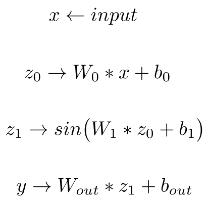

## mfn_CUDA
This repository corresponds to a CUDA implementation of a single layer multiplicative filter network.



## Installation
Any pytorch version should work fine, but we recommend from personal experience
any pytorch version higher than **2.0.0** and CUDA toolkit higher that **12.01**.

Thus, you have just to run 
```
python setup.py install
```
and you are ready to go.

In terms of performance we provide the following table, for evalution 
of **forward**, **backward** and **jacobian** computation compared to automatic differentiation, as 
prompted from running testing_mfn_CUDA.py for the provided data.pth.

For both pipelines we utilize a single RTX-3090 for a batch size of 38890 **2D** points, that were 
positionally encoded before entering the network.
Implementation|Forward Pass|Backward Pass|Jacobian Estimation|
|:-------:|:-------:|:-------:|:-------:|
CUDA(ours)|0.0004|0.0018|0.0020
Pytorch|0.0997|0.0393|0.401


